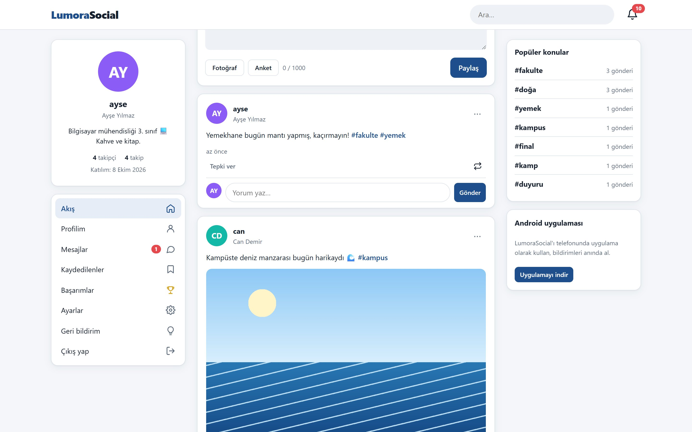
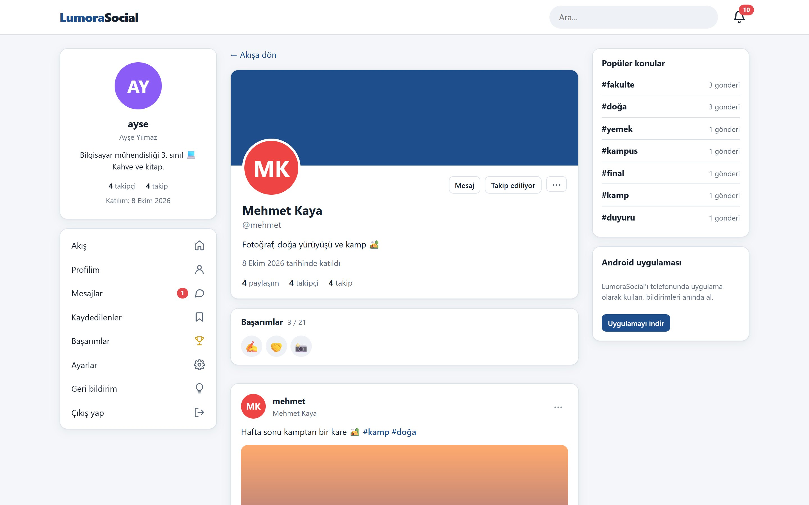
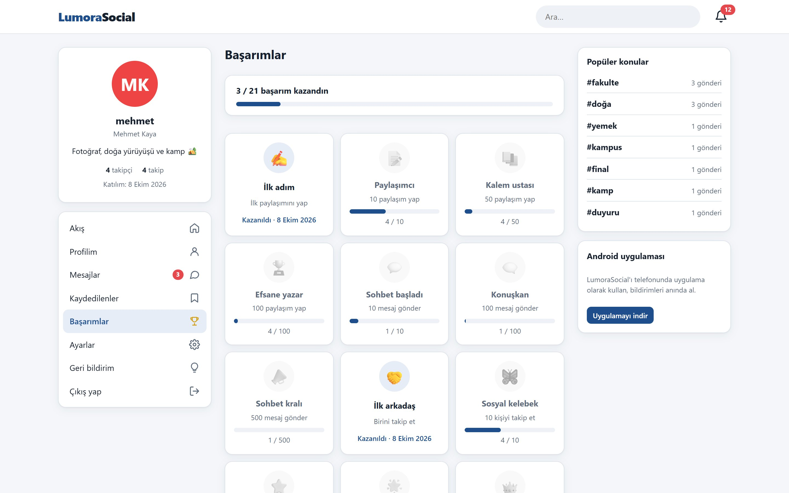
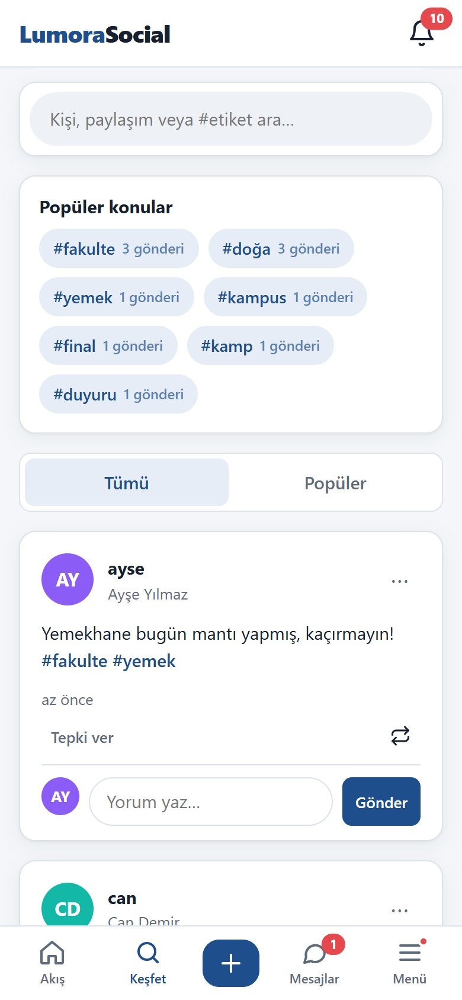
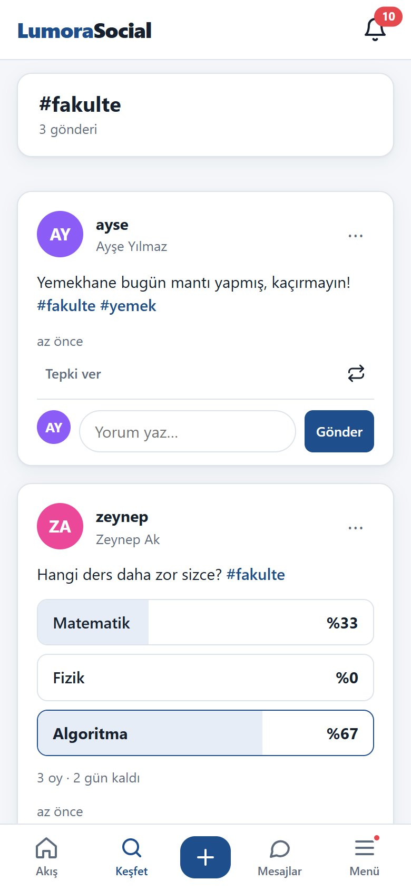
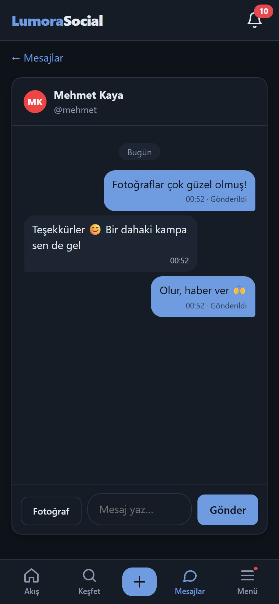

<div align="center">

# LumoraSocial

**Paylaşımlar, hikayeler, mesajlaşma, #etiketler ve otomatik içerik denetimi olan Türkçe sosyal medya.**

**[Canlı demo →](https://lumorasocial.onrender.com)** · **[Android uygulaması](https://lumorasocial.onrender.com/indir)**

Türkçe · [English](README.en.md)

<p>
  
  
  
  
  
  
  
  
</p>

</div>

Arkadaşlar ve topluluklar için bir sosyal medya sitesi. Üyeler yazı, fotoğraf ve anket paylaşır, hikaye atar, birbirini takip eder ve mesajlaşır; küfür ve uygunsuz fotoğraflar paylaşılmadan önce otomatik olarak engellenir. Sunucu Node.js + Express, veritabanı yerelde SQLite, canlıda Turso; arayüz çerçevesiz, sade HTML/CSS/JS ile yazılmış tek sayfa uygulama. Telefon için Android uygulaması da var.

> Demo Render'ın ücretsiz planında çalışıyor. Yaklaşık 15 dakika ziyaretçi gelmezse uykuya geçer; sonraki ilk açılış bir dakikaya kadar sürebilir.

## Ekran görüntüleri

<p align="center">
  
</p>

<p align="center">
  
  
</p>

<p align="center">
  
  
  
</p>

<p align="center"><sub>Akış · Profil ve başarım rozetleri · Başarımlar · Telefonda Keşfet, #etiket sayfası ve mesajlaşma (koyu tema). Görüntüler örnek verilerle çekildi.</sub></p>

## Özellikler

### Paylaşım ve akış
- Yazı, en fazla 4 fotoğraf (tarayıcıda küçültülür, tıklayınca tam ekran) ve anket (2–4 seçenek, süreli) paylaşımı.
- 6 emoji tepkisi, yorumlar, **yeniden paylaşma** (isteğe bağlı yorumla alıntı).
- **Akış:** takip ettiklerinin ve kendi paylaşımların; yöneticinin paylaşımları herkesin akışında görünür, böylece yeni üyelerin akışı boş kalmaz.
- **Keşfet:** tüm paylaşımlar ya da son 7 günün popüler paylaşımları.
- **#etiketler:** etikete tıklayınca etiket sayfası açılır (toplam gönderi sayısı ve o etiketli gönderiler). **Popüler konular** son 30 günün en çok kullanılan etiketlerini sayılarıyla gösterir.
- **@bahsetme:** yazarken kullanıcı adı önerisi, bahsedilene bildirim.
- **Hikayeler:** 24 saat görünür, yazılı ya da fotoğraflı; görenler listesi, emoji tepkisi ve yanıtı (mesaj olarak gider), arşiv ve öne çıkanlar.
- **Kaydedilenler:** paylaşımı ⋯ menüsünden kaydet, ayrı sayfada listele.

### Etkileşim
- **Takip:** açık ya da gizli hesap (takip isteği ile), önerilen kişiler.
- **Mesajlaşma:** birebir mesaj, fotoğraf gönderme, "yazıyor…" göstergesi, "Görüldü", okunmamış sayacı.
- **Bildirimler:** tepki, yorum, yeniden paylaşım, bahsetme, takip, başarım, yeni cihazdan giriş; telefona anlık bildirim (Web Push) ve uygulama simgesinde okunmamış sayısı.
- **Başarımlar:** paylaşım, mesaj, takip, takipçi, yorum, alınan tepki, hikaye, anket, etiket ve üyelik süresine göre 21 başarım. Kazanınca bildirim gelir; profilde rozetler, "Başarımlar" sayfasında ilerleme çubukları görünür.
- **Geri bildirim ve öneri:** üyeler öneri, hata bildirimi ya da diğer başlıklarıyla yazar, durumunu (Yeni / Okundu / Tamamlandı) takip eder; tamamlanınca bildirim alır.

### Profil ve hesap
- Profil ve kapak fotoğrafı, görünen ad, biyografi, doğum tarihi, konum, web sitesi, sosyal bağlantılar, meslek, eğitim, ilgi alanları, doğrulanmış hesap rozeti (✓), yönetici ve denetimci rozetleri.
- Kayıt: e-posta, telefon ya da yalnızca kullanıcı adıyla. E-posta doğrulama, şifremi unuttum, Google / GitHub ile giriş (anahtarı girilen sağlayıcı görünür).
- **Gizlilik:** gizli hesap; doğum tarihi, konum ve iletişim bilgisi için "Herkes / Takipçilerim / Sadece ben"; engelleme.
- **Güvenlik:** aktif oturumlar ve cihazlar, tek tek ya da hepsinden çıkış, yeni cihazdan ve şüpheli girişte bildirim + e-posta uyarısı.
- Açık / koyu tema.

### Güvenli topluluk
- **Otomatik yazı denetimi:** paylaşım, yorum, anket, hikaye, mesaj, kullanıcı adı, isim ve profil bilgilerinde Türkçe ve İngilizce küfür, hakaret ve cinsel içerikli sözcükler reddedilir. `s.i.k`, `4mk`, `f*ck`, `siiiktir` gibi kaçamak yazımları da yakalar; `sıkıldım`, `I got it` gibi masum sözcüklere dokunmaz. Ücretsizdir ve sunucuda çalışır (`src/services/moderation.js`).
- **Otomatik fotoğraf denetimi:** paylaşım, hikaye, mesaj, profil ve kapak fotoğraflarında çıplaklık ve cinsel içerik [Sightengine](https://sightengine.com) ile kontrol edilir (ayda 2000 fotoğrafa kadar ücretsiz). Anahtar girilmezse denetim atlanır; servis hata verirse site çalışmaya devam eder.
- **Şikâyet sistemi:** paylaşım, yorum ve kullanıcılar şikâyet edilebilir; yönetim panelinden içerik silme, askıya alma, çözüldü / yok say.

### Yönetim paneli (`/yonetim`)
- İstatistikler, kullanıcı arama, rol verme (yönetici / denetimci / üye), doğrulama rozeti, askıya alma, şifre sıfırlama, kullanıcı silme, yeni hesap oluşturma.
- **Şikâyetler**, **Geri bildirimler** ve **Kayıtlar** (giriş, kayıt, başarısız giriş, yönetici işlemleri; 180 gün saklanır) sekmeleri.
- **Denetimci** rolü yalnızca şikâyetleri görür ve içerik kaldırabilir.

### Android uygulaması
Site, Trusted Web Activity olarak paketlenmiş bir Android uygulaması olarak da kullanılabilir. `/indir` sayfasından indirilir; yeni sürüm çıkınca uygulama içinde güncelleme şeridi görünür.

## Çalıştırma

```bash
npm install
npm start
```

Tarayıcıda `http://localhost:3000` adresini açın. Geliştirirken `npm run dev` dosya değişince sunucuyu yeniden başlatır.

## Ayarlar (`.env`)

`.env.example` dosyasını `.env` olarak kopyalayıp düzenleyin. Yalnızca `SESSION_SECRET` ve `ADMIN_SETUP_KEY` gerekli; gerisi boş bırakılırsa ilgili özellik kapalı kalır ya da yerel yedeğe düşer.

| Değişken | Açıklama |
|---|---|
| `PORT` | Sunucu portu (varsayılan 3000) |
| `SESSION_SECRET` | Oturum çerezlerini imzalayan uzun rastgele değer |
| `ADMIN_SETUP_KEY` | İlk yönetici kaydında istenen gizli anahtar |
| `DB_PATH` | Yerel veritabanı dosyası (varsayılan `data/lumora.db`) |
| `TURSO_DATABASE_URL`, `TURSO_AUTH_TOKEN` | Doldurulursa veriler Turso bulut veritabanında tutulur |
| `NODE_ENV` | HTTPS arkasında canlıya alırken `production` |
| `APP_URL` | Sitenin dışarıdan açılan adresi (e-posta bağlantıları ve sosyal giriş dönüşleri) |
| `GMAIL_CLIENT_ID`, `GMAIL_CLIENT_SECRET`, `GMAIL_REFRESH_TOKEN`, `MAIL_FROM` | E-postaları Gmail API ile gönderir (SMTP portu kapalı sunucularda da çalışır). İzin için `npm run gmail-izni` |
| `SMTP_*` | Gmail API yerine SMTP ile e-posta |
| `TWILIO_*` | SMS doğrulama; boşsa telefonla kayıt gizlenir |
| `GOOGLE_*`, `GITHUB_*` | Sosyal giriş; anahtarı olmayan sağlayıcının düğmesi görünmez |
| `SIGHTENGINE_USER`, `SIGHTENGINE_SECRET` | Otomatik fotoğraf denetimi |

E-posta ayarlanmazsa doğrulama bağlantıları sunucu penceresine yazılır. Anlık bildirim (Web Push) anahtarları ilk açılışta otomatik üretilip veritabanında saklanır.

## Canlıya alma (Render + Turso, ücretsiz)

1. turso.tech'te bir veritabanı ve token oluşturun.
2. Render'da Web Service açın: Build `npm install`, Start `npm start`.
3. Ortam değişkenleri: `NODE_ENV=production`, `SESSION_SECRET`, `ADMIN_SETUP_KEY`, `APP_URL`, `TURSO_DATABASE_URL`, `TURSO_AUTH_TOKEN` ve kullanmak istediğiniz servislerin anahtarları.
4. Ücretsiz planda site 15 dakika boşta kalınca uyur; bir izleme servisiyle `/saglik` adresine düzenli istek atarak açık tutulabilir.

Fotoğraflar diske değil veritabanına yazılır, bu yüzden Render'ın geçici diski sorun olmaz.

## İlk yönetici

1. Giriş ekranının sağ altındaki **Admin girişi** bağlantısına tıklayın.
2. **İlk yönetici kaydı** sekmesinde `ADMIN_SETUP_KEY` değerini ve hesap bilgilerini girin.
3. Bu kayıt **yalnızca bir kez** yapılabilir; diğer yöneticiler yönetim panelinden eklenir.

## Proje yapısı

```
src/
  server.js          Express uygulaması, sayfa yönlendirmeleri, açılış görevleri
  config.js          .env okuma
  db.js              libsql bağlantısı (yerel / Turso) + sürümlü şema göçleri
  validation.js      Girdi doğrulama ve yazı denetimi
  uploads.js         Resim kaydetme (veritabanına) ve fotoğraf denetimi
  middleware/        auth (giriş / rol kontrolü), rateLimit
  models/            users, posts, follows, messages, stories, notifications,
                     achievements, feedback, safety (engelleme, şikâyet), audit (kayıtlar)
  routes/            auth, oauth, account, users, posts, messages, stories,
                     notifications, search, reports, feedback, push, admin
  services/          moderation (yazı + fotoğraf denetimi), mailer, sms, push,
                     devices, tokens, verification, session, oauthProviders
public/
  index.html         Giriş / kayıt
  app.html           Akış, profil, mesajlar, ayarlar… (tek sayfa)
  admin.html         Yönetim paneli
  indir.html         Android uygulaması indirme sayfası
  sw.js              Anlık bildirimler için service worker
  css/style.css      Tüm stiller (açık / koyu tema)
  js/                app.js, messages.js, stories.js, settings.js, admin.js, …
SURUM_NOTLARI.txt    Sürüm notları
```

## Yeni özellik eklerken

- **Veritabanı:** `src/db.js` içindeki `migrations` dizisine yeni bir eleman ekleyin (mevcutları değiştirmeyin); sunucu açılışta eksik göçleri uygular.
- **Sorgular:** Turso adlı parametreleri (`:id`) desteklemediği için her zaman `?` kullanın.
- **API:** `src/routes/` altına router ekleyip `server.js`'te `app.use('/api/...', ...)` ile bağlayın.
- **Başarımlar:** `src/models/achievements.js` içindeki `ACHIEVEMENTS` listesine satır ekleyin.
- **Yasaklı sözcükler:** `src/services/moderation.js` içindeki `RULES` listesini düzenleyin.
- **Emoji tepkileri:** `src/models/posts.js` içindeki `REACTIONS` listesi.

## Geri bildirim ve öneriler

Her türlü öneri, hata bildirimi ve fikir memnuniyetle karşılanır.

- **Sitenin içinden:** giriş yaptıktan sonra menüdeki **Geri bildirim** sayfasından öneri, hata bildirimi ya da diğer başlıklarıyla yazabilirsin. Mesajın doğrudan yöneticiye ulaşır, tamamlandığında bildirim gelir.
- **GitHub:** hata ve öneriler için [Issues](https://github.com/highlvmami/LumoraSocial/issues) bölümünde konu açabilirsin.
- **Katkı:** pull request'ler açıktır. Büyük bir değişiklik düşünüyorsan önce bir issue açıp konuşalım.
- **E-posta:** lumorasocial.destek@gmail.com

Projeyi beğendiysen bir ⭐ bırakmayı unutma!
